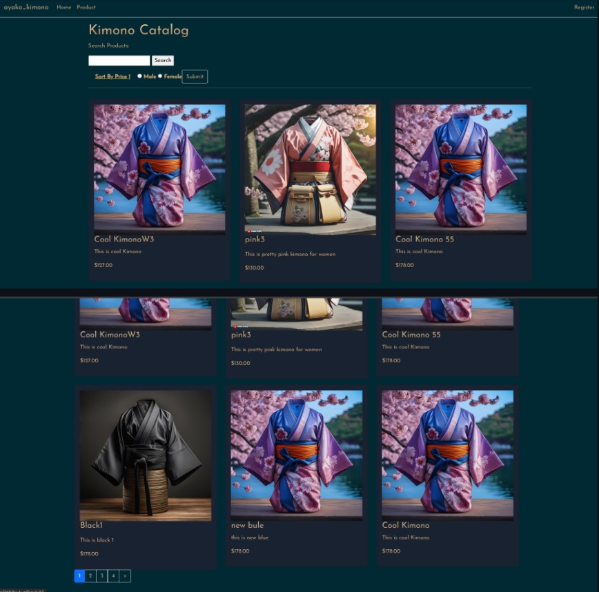

# Kimono e-commerce website

##  The original repository was recreated due to sensitive information in the commit history. If necessary, I can provide specific details upon request.

## About

The website is an ecommerce website that sell Kimono. The following are the main
features of the kimono website:

## If you would like to test as a logged in user
email: victor@gmail.com  
password: Victor@123

## Admin credential
email: multi@gmail.com  
password: Multi@123

### homepage:

### for public audience: 
- Display all products (Kimonos)

- Search product by name

- Sort product by price (lowest to highest/ highest to lowest)

- Filter by gategories (male and female)

- Create account

 

### for logged in users: 
- See all products, search products by name, sort by price, filter by category (same functionalities as public users)
- Add to shopping cart, remove from shopping cart

- Confirm order

- Manage subscription (apply 20% off)

### for admins:
- Able implement to CRUD operation for product
  
   -  Create 
  
   -  Edit
  
   - Delete
  
  

- able to CRUD operation for customers

- Show report (Sales by brand, loyal top 3 customers)

## Database Diagram

## Usecase Diagram

## Flow Diagram

## Sequence Diagram

